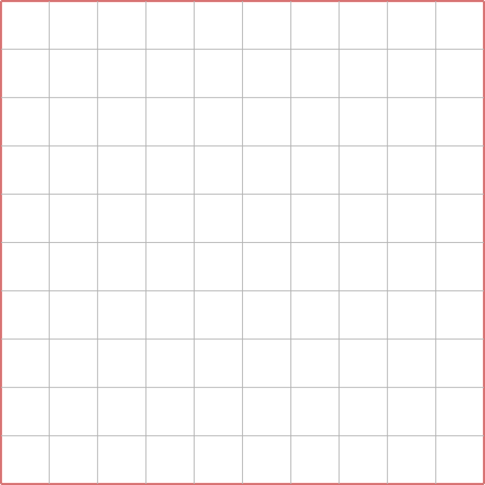
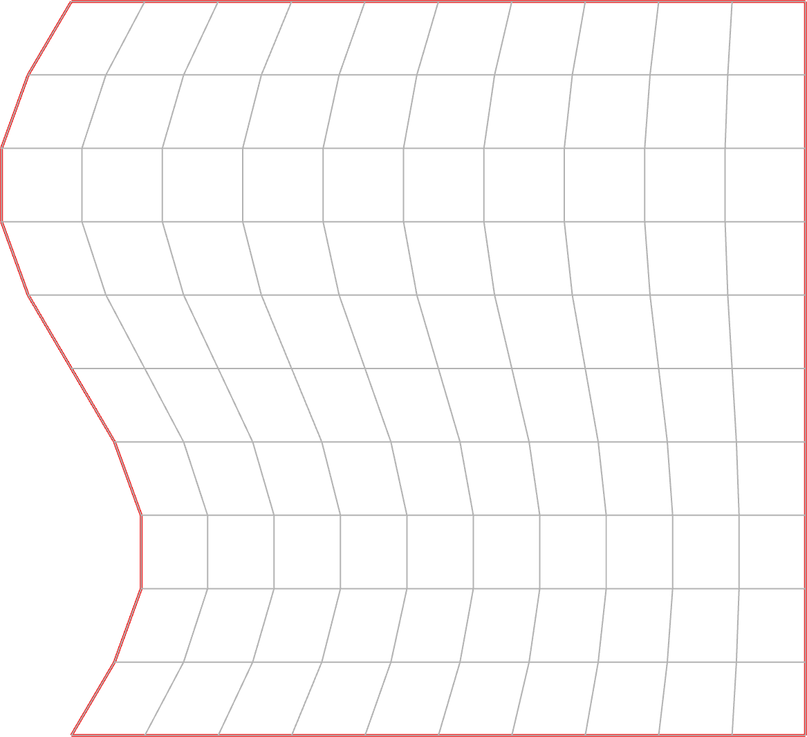
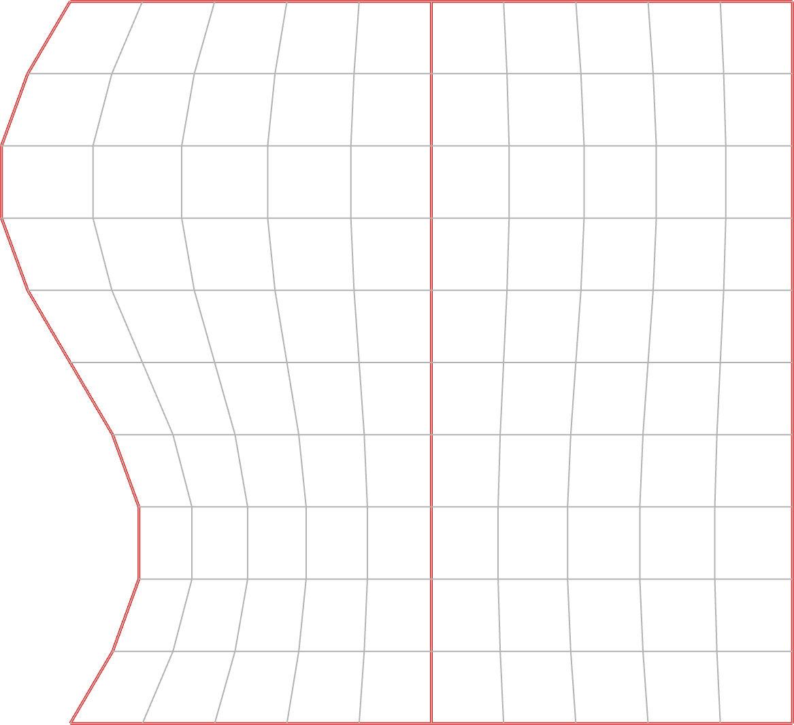
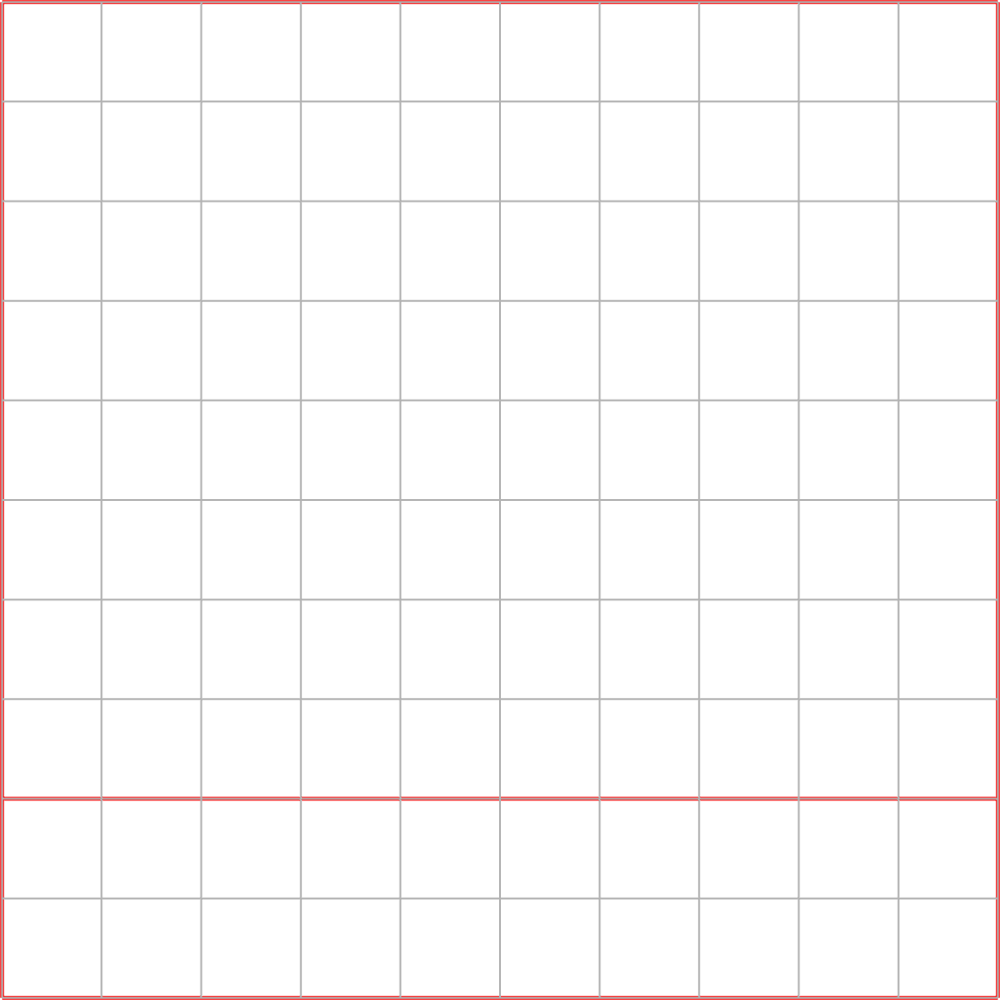
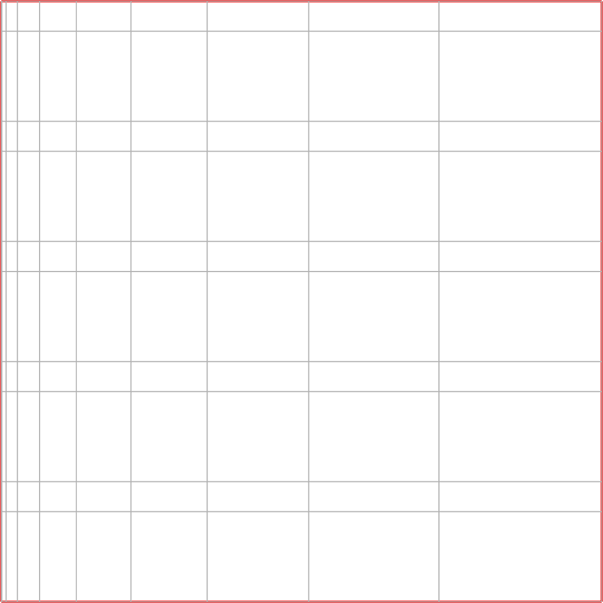
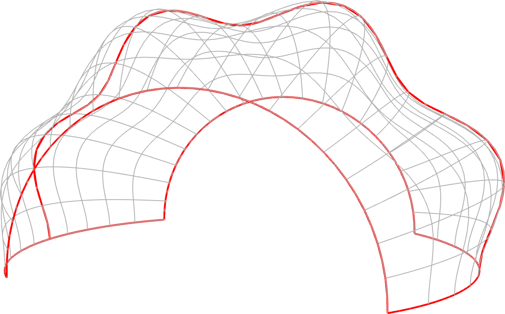
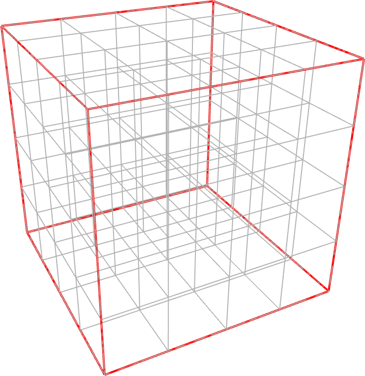
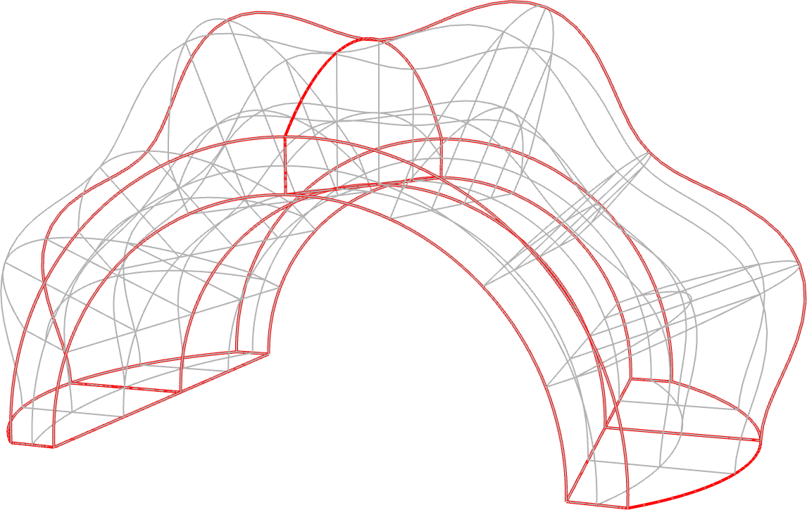

# ndarray-transfinite-interpolation

> Fill an n-dimensional array by interpolating functions that define the boundaries

[![experimental][stability-experimental]][stability-url]
<!--[![Build Status][travis-image]][travis-url]-->
<!--[![npm version][npm-image]][npm-url]-->
<!--[![Dependency Status][david-dm-image]][david-dm-url]-->
<!--[![Semistandard Style][semistandard-image]][semistandard-url]-->

## Introduction

Given a set of functions bounding a domain (as well as internal contours, if desired), this module fills an [ndarray](https://github.com/scijs/ndarray) with an n-dimensional mesh. Its primary use is for creating computational grids.

## Example

To create a planar mesh in two dimensions, specify functions defining the four edges. Each of the four edges is defined by a function of one variable. The easiest way to remember the sequence is as ordered pairs of opposing edges, the first set with `u` ommitted, then `v`.

<p align="center">
  <a href="http://demos.rickyreusser.com/ndarray-transfinite-interpolation/square.html" target="_blank">
    
    <br>
    Try it out (click button to edit on codepen) →
  </a>
</p>

```javascript
var tfi = require('ndarray-transfinite-interpolation');
var zeros = require('ndarray-scratch').zeros;

var edges = [[
  v => [0, v],
  v => [1, v]
], [
  u => [u, 0],
  u => [u, 1]
]];

tfi(zeros([11, 11, 3]), edges);
```

You can perturb the faces with functions:

<p align="center">
  <a href="http://demos.rickyreusser.com/ndarray-transfinite-interpolation/square2.html" target="_blank">
    
    <br>
    Try it out →
  </a>
</p>

```javascript
tfi(zeros([11, 11, 3]), [[
  v => [Math.sin(v * Math.PI * 2), v],
  v => [1, v]
], [
  u => [u, 0],
  u => [u, 1]
]]);
```

Now we can get creative. So far we've defined edges, but you can also define internal curves through which the grid passes.

<p align="center">
  <a href="http://demos.rickyreusser.com/ndarray-transfinite-interpolation/square3.html" target="_blank">
    
    <br>
    Try it out →
  </a>
</p>

```javascript
tfi(zeros([11, 11, 3]), [[
  v => [Math.sin(v * Math.PI * 2), v],
  v => [0.5, v],
  v => [1, v]
], [
  u => [u, 0],
  u => [u, 1]
]]);
```

Notice that although we've defined a straight line through the center, the grid on the righthand side is slightly perturbed in the *opposite* direcdtion. That's because of the [Lagrange interpolation](http://mathworld.wolfram.com/LagrangeInterpolatingPolynomial.html). A future version will include the option to use linear interpolation instead.

By passing an additional array of arrays, you can specify the parameter values at which the respective curves are defined:

<p align="center">
  <a href="http://demos.rickyreusser.com/ndarray-transfinite-interpolation/square4.html" target="_blank">
    
    <br>
    Try it out →
  </a>
</p>

```javascript
const edges = [[
  v => [0, v, 0],
  v => [1, v, 0]
], [
  u => [u, 0, 0],
  u => [u, 0.2, 0],
  u => [u, 1, 0]
]];

const t = [[0, 1], [0, 0.2, 1]]

const A = tfi(zeros([11, 11, 3], 'float32'), edges, t);
```

Finally you can pass functions that map `[0, 1] ⟶ [0, 1]` or else an ndarray or array of matching length that defines the parameter values at which the respective curves are *evaluated*:

<p align="center">
  <a href="http://demos.rickyreusser.com/ndarray-transfinite-interpolation/square5.html" target="_blank">
    
    <br>
    Try it out →
  </a>
</p>


```javascript
const edges = [
  [v => [0, v, 0], v => [1, v, 0]],
  [u => [u, 0, 0], u => [u, 1, 0]]
];

const mapping = [
  u => u * u * u,
  [0, 0.15, 0.2, 0.35, 0.4, 0.55, 0.6, 0.75, 0.8, 0.95, 1]
];

const A = tfi(zeros([11, 11, 3], 'float32'), edges, null, mapping);
```

There's no reason to constrain things to two dimensions. You can interpolate a surface in three dimensions:

<p align="center">
  <a href="http://demos.rickyreusser.com/ndarray-transfinite-interpolation/surface.html" target="_blank">
    
    <br>
    Try it out →
  </a>
</p>

So far we've done surfaces in two or three dimensions. To create a volumetric mesh in three dimensions, imagine a cube parameterized by `[u, v, w]`, with `u ∈ [0, 1]`, `v ∈ [0, 1]`, and `w ∈ [0, 1]`. Each of the six faces is defined by a two-dimensional function. The input to transfinite interpolation is these functions. The easiest way to conceptualize it is as ordered pairs of opposing faces, the first set with `u` ommitted, then `v`, then finally with `w` ommitted.

<p align="center">
  <a href="http://demos.rickyreusser.com/ndarray-transfinite-interpolation/cube.html" target="_blank">
    
    <br>
    Try it out →
  </a>
</p>

```javascript
var faces = [[
    (v, w) => [0, v, w],
    (v, w) => [1, v, w]
  ], [
    (u, w) => [u, 0, w],
    (u, w) => [u, 1, w]
  ], [
    (u, v) => [u, v, 0],
    (u, v) => [u, v, 1]
]];

tfi(zeros([11, 11, 11, 3]), faces);
```

Get fancy. One thing to watch for is that it's very easy to define curves that don't actually meet where they claim to. If they don't match up, you'll still get a decent result, but it might not be what you expect.

<p align="center">
  <a href="http://demos.rickyreusser.com/ndarray-transfinite-interpolation/volume.html" target="_blank">
    
    <br>
    Try it out →
  </a>
</p>


## Install

Not yet on npm. Useful, but needs cleanup.

## API

#### `require('ndarray-transfinite-interpolation')(grid, bounds[, t[, ivars]])`

Fill ndarray `grid` with an evaluation of the specified grid. Options are:

- `grid`: An [ndarray](http://github.com/scijs/ndarray) into which the mesh is evaluated
- `bounds`: An array of arrays containing for each dimension a list of functions that define the mesh. The trailing dimension of `grid` is expected to equal the number of dimensions (equal the length of the array) in `bounds`. Each function is parameterized from 0 to 1 and is expected to return an `Array` with length equal to the trailing dimension of `grid`.
- `t`: An array of arrays specifying the respective value of the parameter at which `bounds` are defined. See above for illustration.
- `ivars`: Independent variables at which to evaluate the grid into `grid`. These maybe be a function that maps `[0, 1] → [0, 1]` or else a one-dimensional array (or ndarray) of length equal to the corresponding dimension of `grid`. If not specified, the grid is evaluated with uniform spacing from 0 to 1.

## See also

- [ndarray-vector-fill](https://github.com/scijs/ndarray-vector-fill)
- [ndarray-grid-connectivity](https://github.com/scijs/ndarray-grid-connectivity)

## License

&copy; 2016 Ricky Reusser. MIT License.

<!-- BADGES -->

[travis-image]: https://travis-ci.org/scijs/ndarray-transfinite-interpolation.svg?branch=master
[travis-url]: https://travis-ci.org//ndarray-transfinite-interpolation

[npm-image]: https://badge.fury.io/js/ndarray-transfinite-interpolation.svg
[npm-url]: https://npmjs.org/package/ndarray-transfinite-interpolation

[david-dm-image]: https://david-dm.org/scijs/ndarray-transfinite-interpolation.svg?theme=shields.io
[david-dm-url]: https://david-dm.org/scijs/ndarray-transfinite-interpolation

[semistandard-image]: https://img.shields.io/badge/code%20style-semistandard-brightgreen.svg?style=flat-square
[semistandard-url]: https://github.com/Flet/semistandard

<!-- see stability badges at: https://github.com/badges/stability-badges -->
[stability-url]: https://github.com/badges/stability-badges
[stability-deprecated]: http://badges.github.io/stability-badges/dist/deprecated.svg
[stability-experimental]: http://badges.github.io/stability-badges/dist/experimental.svg
[stability-unstable]: http://badges.github.io/stability-badges/dist/unstable.svg
[stability-stable]: http://badges.github.io/stability-badges/dist/stable.svg
[stability-frozen]: http://badges.github.io/stability-badges/dist/frozen.svg
[stability-locked]: http://badges.github.io/stability-badges/dist/locked.svg

